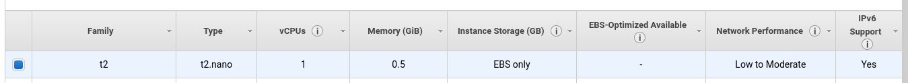

# Day 0

## Sign up for AWS, set up an EC2 instance

[sign up page](https://aws.amazon.com/) > "get started for free"

Once signed up, select your region (top right corner, next to your name)


Region choice is *very* important in terms of [billing](https://www.concurrencylabs.com/blog/choose-your-aws-region-wisely/), and [meeting regulatory requirements](https://techcrunch.com/2019/07/30/aws-follows-microsoft-into-the-middle-east-opening-new-region-in-bahrain/), and [latency](https://medium.com/@sachinkagarwal/public-cloud-inter-region-network-latency-as-heat-maps-134e22a5ff19) If you were using an EC2 instance professionally, you'd need to consider these carefully.  As we're not, this is wholly optional, though choosing a cheap region is no bad thing...

[Launch Instance](https://console.aws.amazon.com/ec2/v2/home)


choose the relevant OS (Linux Upskill Challenge suggests Ubuntu):


Choose t2 nano or t2 micro instance type



We can skip through most of the rest of the configuration, but Linux Upskill Challenge wants us to have the instance **wide open**.  On the security tab, open all ports for all sources


We may also want to add tags to the instance.  This will help with billing if we end up spinning up lots of different services later on.


We can now "preview and launch", which will throw us to a screen like this:


If this is the first time we've launched an ec2 instance, we will also have to follow the instructions to download and change permissions on the `.pem` file.

Otherwise we can simply ssh across and start using our new instance:

```bash
ssh -i "<your key>" ubuntu@ec2<your_instance_public_DNS>
```

Once connected, let's complete the day's tasks by chaining the update commands:

```bash
sudo apt update && sudo apt upgrade -y && sudo apt --purge autoremove -y && sudo apt clean
```

I've included an additional couple of commands: 
`apt --purge autoremove` and `apt clean` help remove defunct or orphaned packages which will save disk space.  The `t2.micro` instance standard disk is 8GB, so cleaning up after ourselves is a good habit to get into.

----

So far, so good.  AWS is a chargeable service though.  Even if you're your outside of the free credits, you're unlikely to generate a huge bill, but it _could_ happen.  To have a bit more control over what's running when, it's a good idea to familiarise ourselves with starting, and stopping the instance.  This can be easily done through the [website](https://console.aws.amazon.com/ec2/v2/home), but messing around in a website each time you want to start / shutdown an instance is a bit of friction we could do without. Instead, we can administer our instances using `aws-shell` on our local machine

The installers are available [here](https://aws.amazon.com/cli/), but seeing as I'm already using Debian at home, I can just `pip install awscli`

to use the console, we also need to create an _IAM_ user.

+ [add IAM user](https://console.aws.amazon.com/iam/)
+ give it admin access
+ create Access keys
+ keep the page open; we'll need these details next

Back to `awscli`, run the following command:

```bash
aws configure
```

Add the details when prompted.  Mistakes are fine here; re-running the command allows you to correct them.

we can now test it works:

```bash
aws ec2 describe-instances
```

_Example Output_

```bash
    {
    "Reservations": [
        {
            "Groups": [],
            "Instances": [
                {
                    "AmiLaunchIndex": 0,
                    "ImageId": "ami-0996d3051b72b5b2c",
                    "InstanceId": "i-069d52b4f1dcae83d",
                    "InstanceType": "t2.micro",
                    "KeyName": "AWS-Linux_Upskill_Challenge",
                    "LaunchTime": "2021-02-16T09:55:10+00:00",
                    "Monitoring": {
                        "State": "disabled"
                    },
                    "Placement": {
                        "AvailabilityZone": "us-east-2b",
                        "GroupName": "",
                        "Tenancy": "default"
                    },
[...]

```

let's find the instance ID instead of wading through that wall of text

```bash
aws ec2 describe-instances --query "Reservations[0].Instances[0].InstanceId"
```

_Example output_

```bash
"i-069d52b4f1dcae83d"
```

_note_: this will return the instance ID of the first Instance in the First Reservation.  if you've set up more than one reservation and/or instance, change the numbers in the square brackets.

now we have the instance ID we can start or stop it:

```bash
aws ec2 start-instances --instance-id <instance ID from the previous step>
aws ec2 stop-instances --instance-id <instance ID from the previous step>
```

The public address of the instance will change if we restart it, but finding out the address is a trivial task:

```bash
aws ec2 describe-instances --query "Reservations[0].Instances[0].PublicDnsName"
```

_Example Output_

```bash
    "ec2-3-138-140-63.us-east-2.compute.amazonaws.com"
```

With some clever use of [subshells](https://www.linuxtopia.org/online_books/advanced_bash_scripting_guide/subshells.html), we can start an instance, wait for it to come up properly and ssh directly into it.  See the [script](./code/aws_shell.sh) in the code directory for an example.

----

## Notes

1. Although I was using bash to connect to the remote machine, I did try using [putty]() also.  The connection is more involved, your `.pem` file needs [converting](https://aws.amazon.com/premiumsupport/knowledge-center/convert-pem-file-into-ppk/) to a `.ppk` file.
2. I also tried awscli on a windows machine; the functionality seems to be essentially the same, though I'm nowhere near familiar enough with Windows scripting to write a `.bat` or `.ps1`.
3. I treated this day more as an exercise in familiarising myself with AWS.  I think there's a real value in being able to spin up a new instance (and I've not seen a cloud equivalent to Linux Upskill Challenge).
