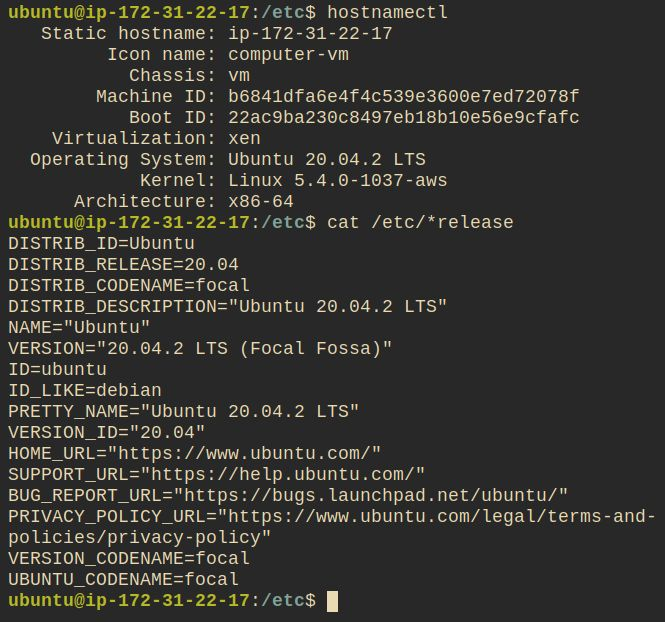

# Day 1: Connect, Change Password, Get System Information

## Notes

### Connect and login remotely to your server

This was broadly covered in day 0, but connecting to a machine is one to the basics that is used *all* the time.
Using the key file it's a  doddle to connect, and we've not done anything to change ports, or complicate the process.

### Run a few simple simple commands to check the status of your server

These are some good basic commands, but not necessarily ones that you'd immediately reach for: If commands are running slowly, I would reach for `top` (or better yet [htop](https://htop.dev/) instead of `free`.  Similarly, I find `uname` a little difficult to read.  Instead, I'd get information from `hostnamectl`, or if I'm interested in the OS details, reading either `/etc/lsb-release`, or `/etc/os-release` (_pro-tip_ `cat /etc/*release/` gets both).



### Change your password

Changing the password is not going to change the way we connect to the machine, but it's [good practise](https://docs.microsoft.com/en-us/microsoft-365/admin/misc/password-policy-recommendations?view=o365-worldwide) to set a _good_ password.

It appears that no passwords are set on the machine, so we'll set a password for `ubuntu` and `root`, and make sure we're prompted to enter our password each time we `sudo`.

```bash
# change user to root
su - root
# change the root password
passwd root
# change the ubuntu password
passwd ubuntu
# find the file which determines whether we are prompted for a password, and update its permissions:
chmod 640 $(grep -rl NOPASSWD /etc/sudoers.d)
# remove (or comment out) the following line: ubuntu ALL=(ALL) NOPASSWD:ALL
vi  $(grep -rl NOPASSWD /etc/sudoers.d)
# restore file permissions
chmod 440 $(grep -rl NOPASSWD /etc/sudoers.d)
# exit the root user
exit
```

The effect should be immediate;  `su - root` will now prompt for the root password.  `sudo <command>` will also prompt for a password.
