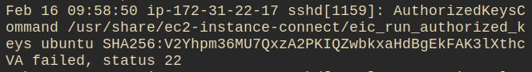
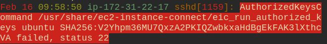

# Day 5 - Viewers and Editors

Viewing and editing files key to administering a Linux system.  As we saw in [day 2](02_-_Basic_Navigation.md) a lot of our system configuration is found in `/etc`, and system logs in `/var`. We need a way of viewing and editing these files.  The course suggests `more`, `less` and `nano`.

I use `more` on a daily basis: if I want to quickly scan a small logfile, or jump to a keyword in a large log, there's little better. Instead of `less` and `nano`, I'm going to argue that `vi` is a better tool.

Although `vi` is an editor, it can be used as a viewer by either `vi -R` or (more obviously) `view`.  Let's compare the output of `less`

with `view`

`view` gives syntax highlighting out of the box.  If you're scanning a file trying to find out why something is not working, syntax highlighting can be a quick way of jumping to issues.  As an example, one of the upgrades I did recently failed because of a syntax error - a character was in the wrong place.  This tiny mistake wasn't obvious in the logs which showed a generic error, but looking at the source code, syntax highlighting made it obvious where the problem lay.

Another key selling point of using `view` as a viewer is that it means I have the full power of vi to play with. For instance, I can see line numbers (`:set nu`),use `buffers`, `visual mode`, and a whole host of other handy tricks.  `vi` undoubtedly has a learning curve, but using it as a viewer as well as an editor means we only need to learn one tool.  Using vi for both is a virtuous circle; things you learn when viewing can be applied to editing and vice versa. Whilst `more` and `less` are not difficult to use, the navigation syntax from `vi` is something that I find far easier to remember.
