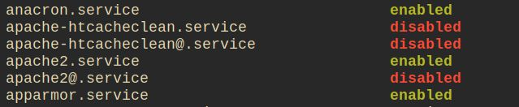
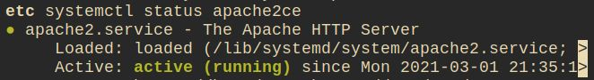
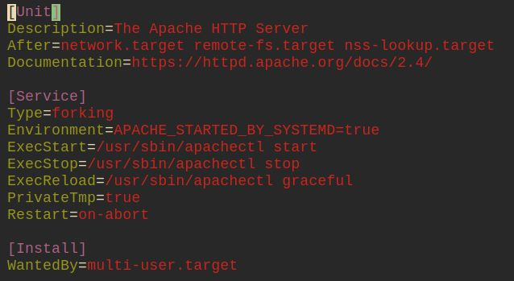
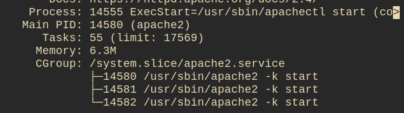
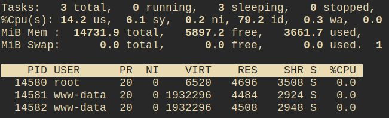

# Day 7 - Apache and Services

A good chunk of the work today was brand new to me; I'm not familiar with Apache, or services. 

The install for apache was satisfyingly easy, and it was a nice bonus that it was running as soon as I went to `localhost:80`

The course talks about starting and stopping the services, but where do these services live, and what others are there?

To view the other installed services, we can issue

```bash
systemctl list-unit-files --type=service
```

pretty close to the top of the first page is our apache2 service



But there's two `apache2` entries:

+ `apache2.service`
+ `apache2@.service`

The `apache2@.service` is a actually a [template](https://www.freedesktop.org/software/systemd/man/systemd.service.html#Service%20Templates).  We can use this template to start apache with specific parameters.

`list-unit-files` gave us information about whether services were enabled or not.  we can find this out more simply by.

```bash
systemctl is-enabled apache2
```

`enabled`, doesn't mean it's running. it means that the service will start at boot.

If we want to disable it we can

```bash
systemctl disable apache2
```

... and re-enable it:

```bash
systemctl enable apache2
```

Let's check the service status.

```bash
systemctl status apache2
```

we can stop it, and see what happens to the status

```bash
sudo systemctl stop apache2
systemctl status apache2
```

start it again, and check it's running

```bash
sudo systemctl start apache2
systemctl status apache2
```

sometimes, we may need to give it a kick: `systemctl restart apache2`

Although we can start, stop, enable and disable the service, we don't know what it looks like.  Let's look for the service file itself.

The `status` command tells us where to look, let's view the file

```bash
vi -R /lib/systemd/system/apache2.service
```



As config files go, this one's nice and easy to read; you can more or less see what is going on without having to _rtfm_.



The `status` command also gives information about the current processes.



We can use `top` to get more information about the processes

```bash
top -p14580,14581,14582
```


